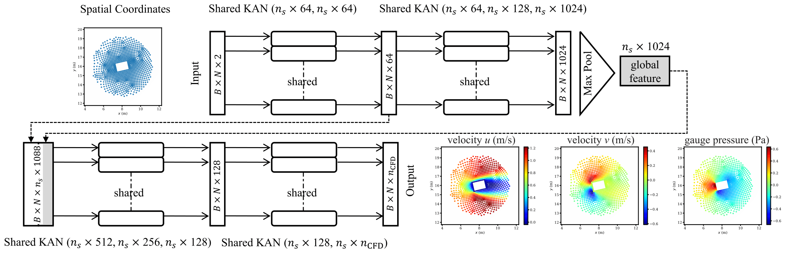

# Kolmogorov-Arnold PointNet (KAN PointNet) for Computational Fluid Dynamics


**Kolmogorov-Arnold PointNet: Deep learning for prediction of fluid fields on irregular geometries**

**Author:** Ali Kashefi (kashefi@stanford.edu) 

**Citation** <br>
If you use the code, please cite the following article: <br>

**[Kolmogorov-Arnold PointNet: Deep learning for prediction of fluid fields on irregular geometries](https://doi.org/10.1016/j.cma.2025.117888)**

    @article{kashefi2024KANpointnetCFD,
      title = {Kolmogorov–Arnold PointNet: Deep learning for prediction of fluid fields on irregular geometries},
      journal = {Computer Methods in Applied Mechanics and Engineering},
      volume = {439},
      pages = {117888},
      year = {2025},
      doi = {https://doi.org/10.1016/j.cma.2025.117888},
      author = {Ali Kashefi}}

**Abstract** <be>

Kolmogorov-Arnold Networks (KANs) have emerged as a promising alternative to traditional Multilayer Perceptrons (MLPs) in deep learning. KANs have already been integrated into various architectures, such as convolutional neural networks, graph neural networks, and transformers, and their potential has been assessed for predicting physical quantities. However, the combination of KANs with point-cloud-based neural networks (e.g., PointNet) for computational physics has not yet been explored. To address this, we present Kolmogorov-Arnold PointNet (KA-PointNet) as a novel supervised deep learning framework for the prediction of incompressible steady-state fluid flow fields in irregular domains, where the predicted fields are a function of the geometry of the domains. In KA-PointNet, we implement shared KANs in the segmentation branch of the PointNet architecture. We utilize Jacobi polynomials to construct shared KANs. As a benchmark test case, we consider incompressible laminar steady-state flow over a cylinder, where the geometry of its cross-section varies over the data set. We investigate the performance of Jacobi polynomials with different degrees as well as special cases of Jacobi polynomials such as Legendre polynomials, Chebyshev polynomials of the first and second kinds, and Gegenbauer polynomials, in terms of the computational cost of training and accuracy of prediction of the test set. Furthermore, we examine the robustness of KA-PointNet in the presence of noisy training data and missing points in the point clouds of the test set. Additionally, we compare the performance of PointNet with shared KANs (i.e., KA-PointNet) and PointNet with shared MLPs. It is observed that when the number of trainable parameters is approximately equal, PointNet with shared KANs (i.e., KA-PointNet) outperforms PointNet with shared MLPs. Moreover, KA-PointNet predicts the pressure and velocity distributions along the surface of cylinders more accurately, resulting in more precise computations of lift and drag.

**Installation** <be>
This guide will help you set up the environment required to run the code. Follow the steps below to install the necessary dependencies.

**Step 1: Download and Install Miniconda**

1. Visit the [Miniconda installation page](https://docs.conda.io/en/latest/miniconda.html) and download the installer that matches your operating system.
2. Follow the instructions to install Miniconda.

**Step 2: Create a Conda Environment**

After installing Miniconda, create a new environment:

```bash
conda create --name myenv python=3.8
```

Activate the environment:

```bash
conda activate myenv
```

**Step 3: Install PyTorch**

Install PyTorch with CUDA 11.8 support:

```bash
pip3 install torch torchvision torchaudio --index-url https://download.pytorch.org/whl/cu118
```

**Step 4: Install Additional Dependencies**

Install the required Python libraries:

```bash
pip3 install numpy matplotlib torchsummary
```

**Step 5: Download the Data** <be>

Use the following batch command to download the dataset (a NumPy array, approximately 42MB in size).

```bash
wget https://web.stanford.edu/~kashefi/data/CFDdata.npy
```

**Questions?** <br>
If you have any questions or need assistance, please do not hesitate to contact Ali Kashefi (kashefi@stanford.edu) via email. 

**About the Author** <br>
Please see the author's website: [Ali Kashefi](https://web.stanford.edu/~kashefi/) 
